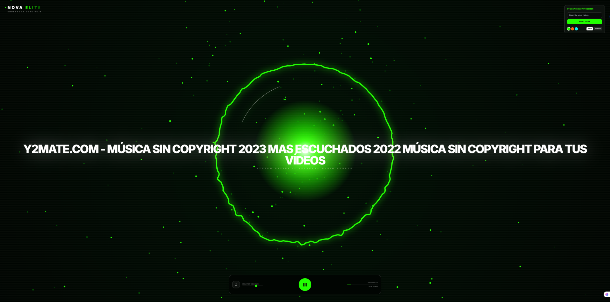
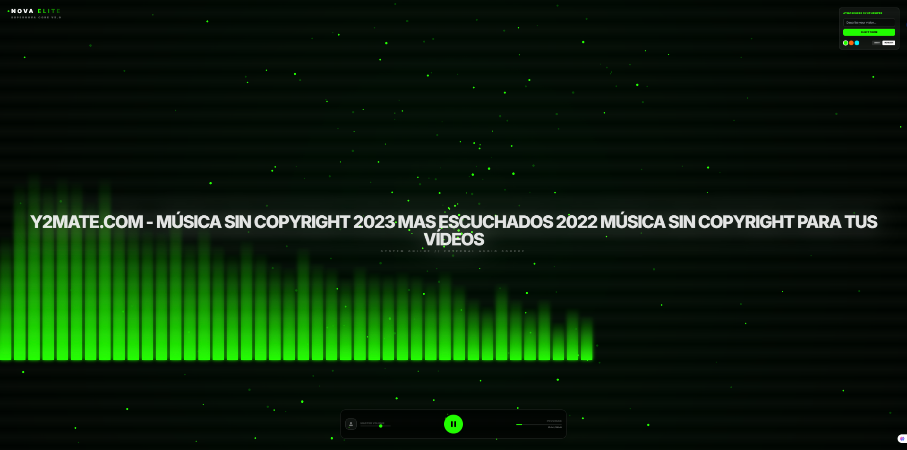

# Supernova


Visualizador de audio en tiempo real con temas generados por IA (Gemini).

[](https://github.com/glastor-dev/supernova/stargazers)
[](https://github.com/glastor-dev/supernova/network/members)
[](https://github.com/glastor-dev/supernova/issues)
[](https://github.com/glastor-dev/supernova/commits/master)
[](https://github.com/glastor-dev/supernova)
[](https://github.com/glastor-dev/supernova/blob/master/LICENSE)


## ¿Qué es?

Supernova es un visualizador musical de alto rendimiento hecho con **React + Vite + TypeScript**, que renderiza efectos en **Canvas** a partir del análisis en tiempo real del audio (Web Audio API). Además, permite generar **temas cinematográficos** mediante **Gemini** a partir de un prompt.

## Funcionalidades

- Visualización en tiempo real con `AnalyserNode` (FFT).
- Dos modos:
  - **Orbital**: anillo de energía + núcleo pulsante + anillo de progreso.
  - **Horizon**: barras “3D” en el horizonte.
- Partículas reactivas + “glitch” en picos de bajos.
- Temas:
  - Presets incluidos.
  - Generación de tema por texto (Gemini) devolviendo configuración en JSON.

## Capturas

### Modo Orbital



### Modo Horizon



## Requisitos

- Node.js (recomendado: LTS)
- Una clave de API de Gemini (solo si vas a usar la generación de temas)

## Instalación

```bash
git clone https://github.com/glastor-dev/supernova.git
cd supernova
npm install
```

## Variables de entorno

### Local

Crea un archivo `.env.local` en la raíz del proyecto:

```bash
GEMINI_API_KEY=tu_api_key_aqui
```

En producción (Vercel) esta variable debe configurarse como **Environment Variable** del proyecto.

### Vercel

- Ve a **Project Settings → Environment Variables**
- Agrega `GEMINI_API_KEY`
- Redeploy

## Ejecutar en desarrollo

```bash
npm run dev
```

El servidor de desarrollo corre en `http://localhost:3000`.

## Uso

1. Sube un archivo de audio (ícono de carga).
2. Reproduce/pausa desde el botón central.
3. Cambia el modo con **ORBIT** / **HORIZON**.
4. (Opcional) Escribe un prompt en “Atmosphere Synthesizer” y pulsa **INJECT THEME** para generar un tema nuevo con Gemini.

## Scripts

- `npm run dev`: servidor de desarrollo
- `npm run build`: build de producción
- `npm run preview`: previsualizar el build

## Estructura del proyecto

```text
.
├─ App.tsx                      # UI y control del audio
├─ components/
│  └─ VisualizerCanvas.tsx      # Render en canvas (Orbital / Horizon)
├─ services/
│  └─ geminiService.ts          # Generación de tema via Gemini
├─ constants.ts                 # Temas por defecto y FFT
├─ types.ts                     # Tipos compartidos
├─ vite.config.ts               # Configuración Vite
└─ index.tsx / index.html       # Bootstrap React
```

## Seguridad (importante)

Para despliegue público (por ejemplo en Vercel), la llamada a Gemini se hace desde un **endpoint serverless** (`/api/generate-theme`) para no exponer la clave en el bundle.

Nota: en local, el endpoint existe en Vercel (runtime serverless). Si quieres probarlo localmente con las funciones, usa `vercel dev`.

## Licencia

Este proyecto se distribuye bajo la **GNU General Public License v3.0**. Consulta el archivo `LICENSE`.

---

© 2010-2026 GLASTOR-DEV — Todos los derechos reservados.  
2025 GLASTOR® marca registrada.

[GitHub](https://github.com/glastor-dev/supernova) • [GPL-3.0](LICENSE) • v1.0.0
